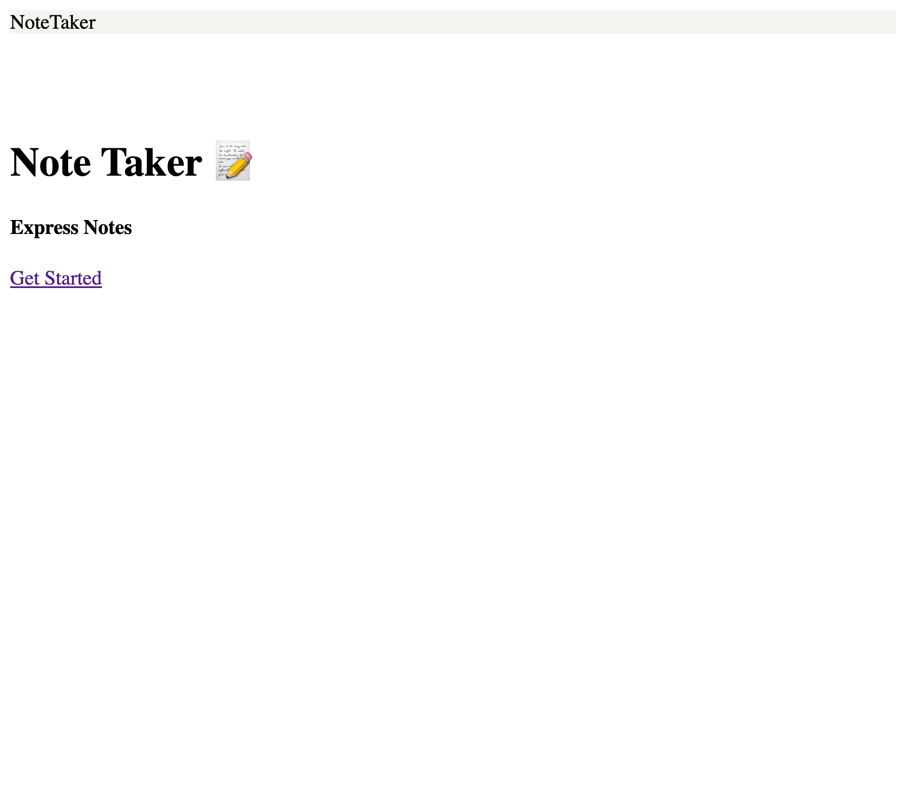

# Express.js: Note Taker

## **Description**
Note taker app using Express.js

## **Table of Contents**
* [Installation](#installation)
* [Usage](#usage)
* [Contributions](#contributions)
* [Licenses](#licenses)
* [Badges](#Badges)
* [Questions](#questions)

### **Installation**
npm
espress

### **Usage**
⏯
https://express-notesjl.herokuapp.com/

### **Technologies Used:**
* Express.js
* JavaScript
* npm

### *Contributions*

### *Licenses*
MIT license

### *Badges*

### *Questions*
If you have any questions, reach out to me on Git Hub https://github.com/JJLindsey, or send me a message jlindsey010@gmail.com.

©Jennifer Lindsey 2021